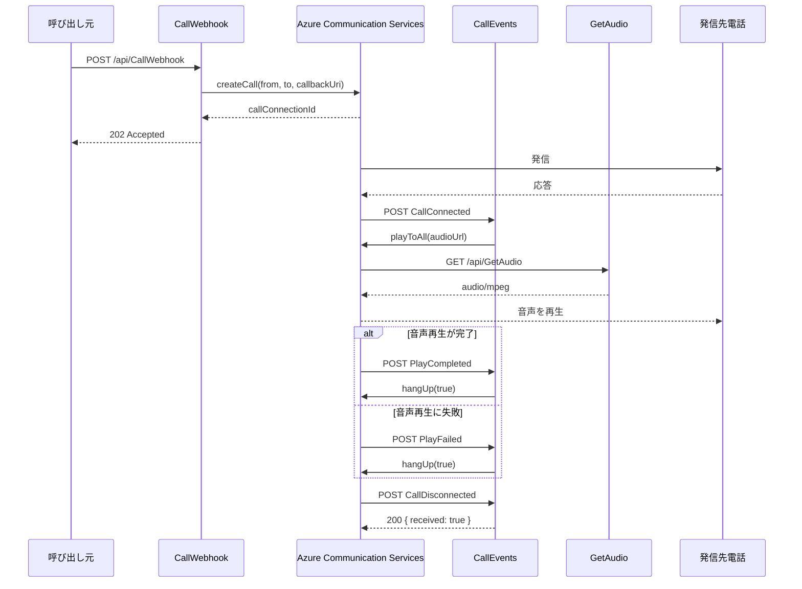

# Azure Communication Service - Phone Calling App

Azure Communication Services の Call Automation を使って PSTN に発信し、相手が応答したら音声ファイルを再生して通話を終了する Azure Functions アプリです。Node.js/TypeScript で実装し、Azure リソースは Bicep で管理します。

## 🚀 機能

- Azure Communication Service を使用した電話発信
- 発信後の `CallConnected`、`PlayCompleted`、`PlayFailed`、`CallDisconnected` イベント処理
- Function 経由の MP3 音声配信
- TypeScript による型安全な実装
- 環境変数による設定管理
- Azure リソースの IaC（Infrastructure as Code）による管理

## 📋 前提条件

- Node.js 20 以上 23 未満
- Azure サブスクリプション
- Azure CLI（リソースデプロイ用）
- Azure Functions Core Tools（ローカル実行用）

## 🔧 セットアップ

### 1. 依存関係のインストール

```bash
cd functions
npm install
```

### 2. Azure リソースのデプロイ

`infra/main.bicepparam` のパラメーターを環境に合わせて変更してから、リソースグループにデプロイします。

```bash
# リソースグループの作成
az group create --name rg-communication-service --location japaneast

# Bicep テンプレートのデプロイ
az deployment group create \
  --resource-group rg-communication-service \
  --template-file infra/main.bicep \
  --parameters infra/main.bicepparam
```

### 3. Function App の設定

ローカルではリポジトリ直下の `.env` を使用します。`.env.example` をコピーして、次の値を設定してください。

```env
COMMUNICATION_SERVICES_CONNECTION_STRING=<your-connection-string>
FROM_PHONE_NUMBER=<your-purchased-phone-number>
TO_PHONE_NUMBER=<destination-phone-number>
CALLBACK_URL=http://localhost:7071/api/CallEvents
CALLBACK_FUNCTION_KEY=<CallEvents-function-key-if-required>
GETAUDIO_FUNCTION_KEY=<GetAudio-function-key>
AUDIO_FILE_URL=<public-audio-url-if-not-using-GetAudio>
```

Azure 上では Function App のアプリケーション設定に同じ値を登録します。Bicep は `COMMUNICATION_SERVICES_CONNECTION_STRING`、電話番号、`AUDIO_FILE_URL`、`GETAUDIO_FUNCTION_KEY` を設定しますが、`CALLBACK_URL` と `CALLBACK_FUNCTION_KEY` は Function キー確定後に追加してください。

`CALLBACK_URL` を設定しない場合は、`WEBSITE_HOSTNAME` と `CALLBACK_FUNCTION_KEY` から `CallEvents` の URL が自動生成されます。`CallWebhook`、`CallEvents`、`GetAudio` はすべて Function 認証です。

### 4. 電話番号の購入

Azure Portal で Communication Service の PSTN 対応電話番号を購入し、`FROM_PHONE_NUMBER` に設定します。発信先は E.164 形式で指定してください。

## 🎯 使い方

### Function の構成

| Function | メソッド | 役割 |
| --- | --- | --- |
| `CallWebhook` | `POST` | 発信を開始し、`202 Accepted` と `callConnectionId` を返す |
| `CallEvents` | `POST` | ACS の callback を受け、接続後の音声再生と切断を行う |
| `GetAudio` | `GET` | `functions/public/message.mp3` を `audio/mpeg` として配信する |

`CallWebhook` は電話がつながるまで待たずに応答します。ACS が `CallEvents` に `CallConnected` を通知すると音声再生を開始し、`PlayCompleted` または `PlayFailed` で通話を切断します。

### 通話処理シーケンス

`CallWebhook` の `202 Accepted` は発信要求の受付を示すだけで、通話接続の完了を示しません。通話状態の変化は ACS から `CallEvents` に非同期で通知されます。



`CallWebhook` は callback URL に `CallEvents` の Function Key と `audioUrl` を付けて ACS に登録します。`CallConnected` の callback を受けた `CallEvents` は、その URL の音声を ACS に再生させます。相手が先に切断した場合は `CallDisconnected` を記録して終了します。

### 発信 API の呼び出し

`toPhoneNumber` と `audioUrl` はリクエストで上書きできます。省略時はそれぞれ `TO_PHONE_NUMBER` と、`WEBSITE_HOSTNAME`/`GETAUDIO_FUNCTION_KEY` から生成した `GetAudio` URL、または `AUDIO_FILE_URL` が使われます。

```json
{
  "toPhoneNumber": "+819012345678",
  "audioUrl": "https://<function-app>.azurewebsites.net/api/GetAudio?code=<GetAudio-function-key>"
}
```

レスポンスが `202` でも、通話接続や音声再生の成功を保証するものではありません。イベントの実行結果は Function のログまたは Application Insights で確認してください。

以降の npm コマンドは `functions` ディレクトリで実行します。

### ビルド

```bash
npm run build
```

### 実行

```bash
# Azure Functions をローカル起動（Azure Functions Core Tools が必要）
npm start
```

### その他のコマンド

```bash
# TypeScript の監視モード
npm run watch

# テスト（現在はプレースホルダー）
npm test
```

## 📁 プロジェクト構造

```
azure-communication-service/
├── functions/              # Azure Functions アプリ
│   ├── app.ts              # Function 登録用エントリーポイント
│   ├── public/             # 配信する音声ファイル
│   └── src/functions/
│       ├── CallWebhook.ts  # 発信開始 API
│       ├── CallEvents.ts   # ACS callback と通話制御
│       └── GetAudio.ts     # 音声ファイル配信 API
├── infra/                 # Azure リソーステンプレート
│   ├── main.bicep         # Bicep テンプレート
│   └── main.bicepparam    # パラメータファイル
├── docs/
│   └── swagger.yaml       # OpenAPI 定義
├── .env.example           # 環境変数のテンプレート
└── README.md
```

## 🔒 セキュリティ

- `.env` ファイルは Git にコミットしないでください（`.gitignore` に含まれています）
- 接続文字列や電話番号などの機密情報は環境変数で管理してください
- Function Key を URL、チャット、ログ、ソースコードに直接記録しないでください
- Function Key が漏えいした場合は Azure Portal で再生成してください
- Azure リソースへのアクセス権限を適切に設定してください

## 💰 料金について

- Azure Communication Service は従量課金制です
- 電話番号のレンタル料金が発生します
- 通話料金は使用量に応じて課金されます

詳細は [Azure Communication Services の価格](https://azure.microsoft.com/pricing/details/communication-services/) を参照してください。

## 📚 参考リンク

- [Azure Communication Services ドキュメント](https://learn.microsoft.com/azure/communication-services/)
- [Calling SDK の機能](https://learn.microsoft.com/azure/communication-services/concepts/voice-video-calling/calling-sdk-features)
- [クイックスタート: 電話をかける](https://learn.microsoft.com/azure/communication-services/quickstarts/voice-video-calling/pstn-call)

## 📝 ライセンス

MIT License

## 🤝 貢献

プルリクエストを歓迎します！バグ報告や機能リクエストは Issue で受け付けています。