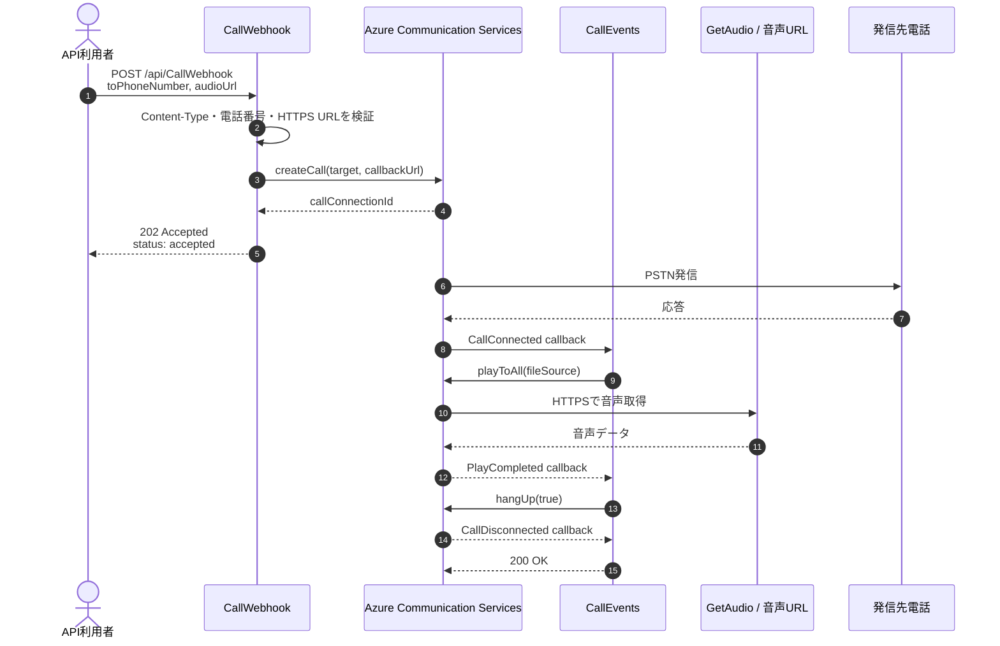
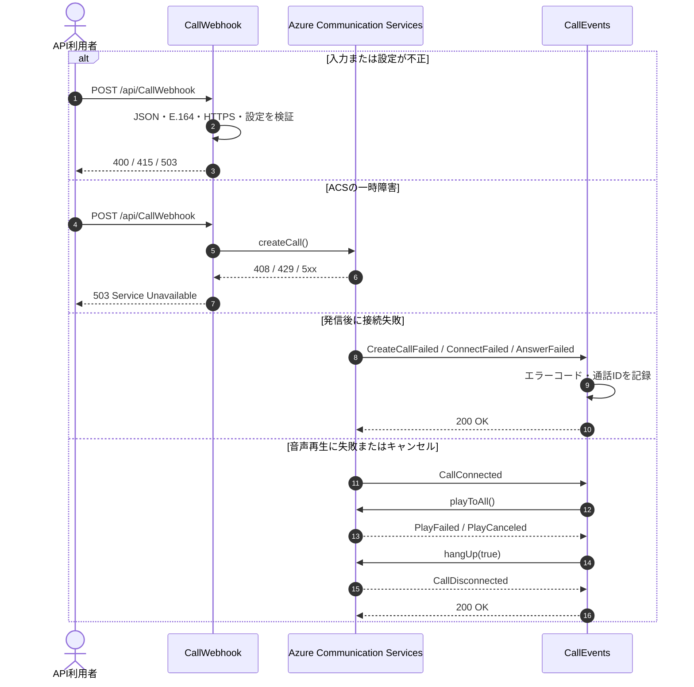
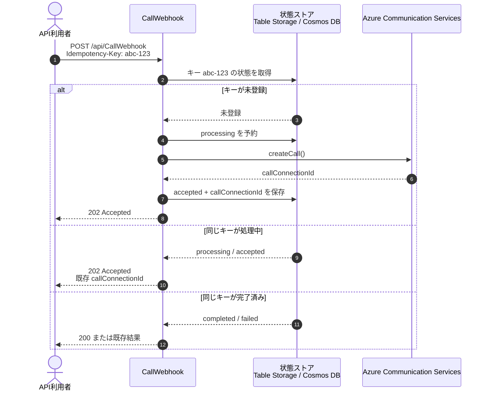

# Azure Communication Services 通話アプリ安定性改善計画

更新日：2026-08-14

## 実施順の詳細

### フェーズ1：障害率をすぐ下げる【完了】

- [x] `CallWebhook` からポーリングを削除
- [x] `202 Accepted` を返す
- [x] `CallEvents` を追加
- [x] `CallConnected` で再生
- [x] `PlayCompleted` / `PlayFailed` / `PlayCanceled` で切断
- [x] ダミー callback URL を削除
- [x] 設定名をコード・Bicep で統一
- [x] 秘密情報をログ・レスポンスに出さない
- [x] TypeScript ビルドを実行
- [ ] 実通話・統合テストを実行

### フェーズ2：再実行と障害復旧を強化【一部対応】

- [ ] `Idempotency-Key` を導入
- [ ] 通話状態を保存
- [x] callback の複数イベント payload に対応
- [ ] callback の重複イベントを状態管理込みで冪等に処理
- [ ] ACS エラーコードを分類・保存
- [ ] 一時障害向けのリトライポリシーを追加
- [x] すでに終了した通話を終端状態として扱う
- [ ] ACS callback の JWT を検証

### フェーズ3：性能と運用を改善【未着手】

- [ ] `GetAudio` の同期 I/O を廃止
- [ ] 音声ファイルを Blob Storage / CDN へ移行検討
- [ ] Application Insights のカスタムメトリックを追加
- [ ] KQL ダッシュボードを作成
- [ ] 5xx・`PlayFailed`・callback 未受信アラートを追加
- [ ] コールドスタートと同時発信の負荷テスト
- [ ] 必要に応じて Consumption から Flex Consumption / Premium を検討
- 確認済み：TypeScript ビルド成功、変更ファイルの診断エラーなし、`git diff --check` 成功
- 未実施：実通話テスト、ユニットテスト、フェーズ2の冪等性実装

## 3. 実施ロードマップ

### フェーズ1：障害率をすぐ下げる【完了】

1. `CallWebhook` からポーリングと固定時間待機を削除
2. `createCall()` 実行後すぐに `202 Accepted` を返す
3. `CallEvents` を追加し、ACS callback を受信する
4. `CallConnected` で音声を再生する
5. `PlayCompleted` / `PlayFailed` / `PlayCanceled` で切断する
6. ダミー callback URL を削除し、HTTPS を必須にする
7. コード、Bicep、ローカル設定の環境変数名を統一する
8. 秘密情報をログやエラーレスポンスに出さない
9. ビルドと最小限のテストを実行する

### フェーズ2：再実行と障害復旧を強化【一部対応】

1. `Idempotency-Key` を必須化または導入する
2. Table Storage / Cosmos DB などへ通話状態を保存する
3. 未登録確認と `processing` 予約を原子的に実行する
4. callback の重複・遅延イベントを状態管理込みで冪等に処理する
5. ACS のエラーコード、SubCode、SIP / Q.850 情報を分類・保存する
6. 一時障害だけを対象にリトライする
7. callback の ACS 署名付き JWT を検証する
8. 二重発信、重複イベント、終了済み通話のテストを追加する

対応済みのフェーズ2要素は、後述の「対応状況」で管理する。残りはこのフェーズの次の実装対象。

### フェーズ3：性能と運用を改善【未着手】

1. `GetAudio` の同期ファイル I/O を非同期化する
2. 音声ファイルを Blob Storage / CDN へ移行検討する
3. Application Insights のカスタムメトリックと KQL ダッシュボードを追加する
4. 5xx、`PlayFailed`、callback 未受信などのアラートを追加する
5. 同時発信、ACS 遅延、callback 重複配送、コールドスタートの負荷テストを行う
6. 必要に応じて Consumption から Flex Consumption / Premium へ移行検討する

## 4. 成功基準

実装前に過去24時間または直近100〜500件のベースラインを取得し、以下を改善後と比較する。

- `CallWebhook` の 5xx 率：0.5% 未満
- `CallEvents` の 5xx 率：0.1% 未満
- 発信受付から `CallConnected` までの p95
- `CallConnected` に対する `PlayCompleted` 到達率
- 二重発信率：0件
- `PlayFailed` 率
- callback 未受信率
- `GetAudio` の 404 / 5xx 率
- コールドスタート時の成功率

---

## 5. 詳細な改善内容

### 結論
あたいのおすすめは、通話処理を「1回の HTTP リクエストで完結させる設計」から「コールバックイベントで進める非同期ステートマシン」に変えること。

今の CallWebhook.ts は、

発信
最大30秒ポーリング
接続確認
音声再生
固定時間待機
切断
を全部1回の HTTP 実行でやってる。これがエラー率・タイムアウト・二重発信の最大リスクだね。

Azure Functions 公式でも、長時間処理は HTTP 関数から切り離して即時応答する設計が推奨されてる。ACS Call Automation も CallConnected、PlayCompleted、PlayFailed、CallDisconnected などのイベントを前提にした非同期フローにできる。

優先度 P0：最初に直すべき項目
1. 通話処理をコールバック方式に変更
対象：

CallWebhook.ts
新規 functions/src/functions/CallEvents.ts
app.ts
swagger.yaml
変更後の流れはこう。

CallWebhook は以下だけにする。

JSON の形式チェック
電話番号の検証
音声 URL の検証
createCall() 実行
callConnectionId を返す
通話状態を accepted としてログ出力
レスポンスは 200 ではなく、発信を受け付けたことを示す 202 Accepted が自然。

これで以下をまとめて潰せる。

30秒ポーリングによる遅延
Functions のタイムアウト
HTTP クライアント側のタイムアウト
クライアント再試行による二重発信
固定秒数待機による早すぎる切断・遅すぎる切断
2. 音声再生完了イベントで切断
現状は AUDIO_DURATION_MS の固定時間待機で切断しているけど、音声ファイルの実際の長さとズレる可能性がある。

CallEvents.ts では次のイベントを処理する。

CallConnected
playToAll() を実行
PlayCompleted
hangUp(true) を実行
PlayFailed
エラー情報を記録
必要なら切断
PlayCanceled
終了処理
CallDisconnected
終端状態として記録
CreateCallFailed
発信失敗として記録
ACS の PlayCompleted / PlayFailed は、音声操作の成功・失敗を判定するための公式イベント。固定タイマーよりかなり安定する。

3. コールバック URL を必須設定にする
現在は設定がない場合、次のダミー URLにフォールバックしてる。

これは本番で「発信自体は成功したのに、その後のイベントが届かない」という事故を作る。

推奨：

CALLBACK_URL がない場合はアプリ起動時、または設定読み込み時に明確に失敗
CALLBACK_URL に /api/CallEvents を含める
URL が HTTPS か検証
ダミー URLへのフォールバックを削除
Bicep から設定値を注入
Function key 方式を使う場合は callback URL に正しいキーを付与
可能なら ACS の署名付き JWT を検証
ACS の Call Automation webhook は、署名付き JWT の検証が推奨されている。Function key だけに依存すると、ACS からのイベント検証としては弱い。

優先度 P0：二重発信と再実行への対策
4. 冪等性キーを導入
今の実装では、クライアントがタイムアウトして再送すると、同じ電話番号へ複数回発信する可能性がある。

CallWebhook に以下を追加する。

Idempotency-Key ヘッダーを必須化
またはリクエストボディに requestId を追加
同じキーが処理済みなら既存の callConnectionId を返す
同じキーが処理中なら 202 と現在状態を返す
一定時間経過後に期限切れにする
保存先候補は、規模が小さいうちは以下。

Azure Table Storage
Cosmos DB
Azure Cache for Redis
ただし、発信処理の重複防止が目的なら、まずは Azure Table Storage でも十分。

状態は例えばこうする。

accepted
connecting
connected
playing
completed
failed
disconnected
callConnectionId、requestId、発信先、開始時刻、最終イベント、ACS のエラーコードを保存すると、障害調査がかなり楽になる。

5. すでに終了した通話を正常な終端として扱う
ACS のイベントは重複・遅延して届く可能性があるため、CallEvents はイベントを何度受け取っても壊れないようにする。

特に以下は、必ずしもアプリ障害ではない。

Call not found
すでに切断済み
PlayCompleted 後に遅れて届くイベント
CallDisconnected 後の操作
「すでに終端なら成功扱い」にできる処理と、本当に再試行すべき失敗を分けるのが大事。

優先度 P1：入力と設定を堅牢化
6. リクエスト検証を追加
現状は request.json() の結果をほぼそのまま使っている。

最低限、以下を検証する。

Content-Type: application/json
JSON がオブジェクトであること
toPhoneNumber が E.164 形式であること
発信先電話番号の長さ
audioUrl が HTTPS の URL であること
許可するホスト名の allowlist
audioUrl が  や内部 IP を指していないこと
AUDIO_DURATION_MS が有限の正数であること
本番では TO_PHONE_NUMBER に依存しないこと
電話番号検証の失敗は 400、設定不足は 500 ではなく 503 または起動時の設定エラーとして区別したい。

7. 設定を一元管理する
現在、コードと Bicep の間に設定のズレがある。

コードが参照している主な設定：

COMMUNICATION_SERVICES_CONNECTION_STRING
FROM_PHONE_NUMBER
TO_PHONE_NUMBER
CALLBACK_URL
GETAUDIO_FUNCTION_KEY
AUDIO_FILE_URL
AUDIO_DURATION_MS
一方、main.bicep で設定されているのは主に以下。

COMMUNICATION_SERVICE_CONNECTION_STRING
AUDIO_DURATION_MS
Application Insights 関連設定
まず名前を完全に統一する。

特に以下は要注意。

COMMUNICATION_SERVICES_CONNECTION_STRING
COMMUNICATION_SERVICE_CONNECTION_STRING
この差分は、設定自体はあるのにコードから見ると未設定になる系の事故を起こす。

また、FROM_PHONE_NUMBER や CALLBACK_URL が Bicep から設定されていないため、本番起動時に不完全な動作になりやすい。

8. 起動時の設定エラーを改善
現在はモジュールロード時に環境変数がなければ即 throw している。

これは設定ミスを早期検知できる一方で、1つの設定ミスで Function App 全体がロード不能になる。

改善案：

設定値を config.ts に集約
必須設定を一覧化
秘密値そのものはログに出さない
起動時に設定名だけを検証
GETAUDIO_FUNCTION_KEY のようなキーをログやレスポンスに出さない
ローカルと Azure で同じ設定名を使う
接続文字列は Bicep に直書きするより、将来的には Key Vault 参照またはマネージド ID ベースへ寄せたい。

優先度 P1：GetAudio の安定性と性能
対象：

GetAudio.ts
9. 同期ファイル I/O を非同期化
現状は以下が同期処理。

fs.existsSync
fs.readFileSync
Node.js のイベントループをブロックするため、同時アクセスが増えたときに他の Function の処理にも影響する。

改善案：

起動時に一度だけ音声ファイルを読み込む
または fs.promises.readFile() を利用
ファイルがない場合は起動時に検知
ファイルサイズをログに出す
大きい音声なら Blob Storage や CDN 配信に移行
同じ固定ファイルを毎回 Function から返すなら、安定性・スケール・コールドスタートの面では、以下の優先順位がおすすめ。

Azure Blob Storage
CDN または Front Door
Function からの配信は開発用途に限定
10. 音声形式を実装とドキュメントで統一
現状はコードが MP3 を返している一方で、コメントと Swagger は WAV 推奨になっている。

どちらかに統一する。

MP3 を継続するなら、コメント・Swagger・運用手順を MP3 に統一
WAV を使うなら、ファイル形式と Content-Type を合わせる
音声ファイルのコーデック、サンプリングレート、チャンネル数は、本番の PSTN 品質に直結するから、サンプル音声を固定してテストする。

優先度 P1：エラー処理を正しくする
11. ステータスコードを処理結果に合わせる
現状では、30秒以内に接続しなくても次のように 200 を返している。

これだと監視上は成功に見えるし、クライアントも再試行判断を誤る。

改善後の方針：

状況	HTTP
発信を受け付けた	202
入力不正	400
認証・権限エラー	401 / 403
同じ idempotency key の処理中	202
一時的な ACS 障害	503
設定不備	500 または 503
Callback 受信成功	200
未知イベント	200 + 警告ログ
ACS に対しては、イベントを受け取って処理を継続できる場合は、コールバック Function 自体は素早く 200 を返すことが重要。

12. リトライ対象を分類
すべてのエラーをリトライすると、二重発信や無限ループにつながる。

リトライ候補：

一時的なネットワークエラー
ACS の 408
ACS の 429
ACS の 5xx
一時的な DNS / 接続失敗
リトライしないもの：

電話番号不正
401 / 403
権限不足
設定不足
音声 URL が 404
すでに通話終了
サポート対象外の操作
ACS のコールバックでは ResultInformation.Code、SubCode、Message、可能なら SIP / Q.850 の診断情報も保存する。

優先度 P1：ログ・監視・アラート
13. 構造化ログを追加
今は文字列ログが中心で、検索時に情報を取り出しにくい。

各ログに最低限これを含める。

invocationId
requestId
callConnectionId
operationContext
functionName
eventType
toPhoneNumber のマスク値
acsErrorCode
acsSubCode
durationMs
result
秘密情報は絶対にログに出さない。

特に今の CallWebhook.ts は、音声 URL に Function key がクエリパラメーターで入る可能性があり、その URL をログ出力している。これはすぐにマスクしたい。

14. Application Insights のサンプリングを見直す
host.json は現在、Request をサンプリング除外している。

加えて、エラー率を正確に見たいなら次を検討する。

Exception をサンプリング除外
Request をサンプリング除外
通常のトレースはサンプリング対象
ACS の結果イベントはカスタムメトリックに記録
本番ログの保持期間を要件に合わせる
日次クォータ 0.023 GB が小さすぎないか確認
記録したいカスタムメトリック例：

CallAccepted
CallConnected
CallCreateFailed
PlayCompleted
PlayFailed
CallDisconnected
CallbackValidationFailed
DuplicateRequest
AudioFetchFailed
15. アラートを作る
最低限、以下のアラートを用意する。

CallWebhook の 5xx 率
CallEvents の 5xx 率
GetAudio の 404 / 5xx
CreateCallFailed 件数
PlayFailed 件数
Callback 未受信数
発信受付数と CallConnected 数の乖離
発信受付数と PlayCompleted 数の乖離
Function 実行時間の p95 / p99
Application Insights の例外数
Function App のホスト再起動数
重要なのは、HTTP の成功率だけでなく、業務上の成功率を監視すること。

例えば、HTTP が全て 202 でも、CallConnected が少なければ電話機能としては失敗している。

優先度 P2：テストとデプロイ品質
16. テストを追加
現在の package.json はテストが未実装。

最低限、次のテストを追加する。

単体テスト
電話番号なし
不正な電話番号
不正な JSON
audioUrl なし
不正な audioUrl
必須環境変数なし
CALLBACK_URL なし
不正な AUDIO_DURATION_MS
ACS createCall() の 429
ACS createCall() の 403
CallConnected
PlayCompleted
PlayFailed
CallDisconnected
重複イベント
すでに終了した通話
結合テスト
CallWebhook が短時間で 202 を返す
発信後に CallConnected が届く
接続後に音声再生される
再生完了後に切断される
Play 失敗時に切断される
Callback の認証失敗が拒否される
同じ idempotency key で二重発信されない
負荷テスト
同時発信数
同じ電話番号への重複リクエスト
ACS API の遅延
Callback の重複配送
GetAudio 同時アクセス
コールドスタート直後の発信
17. ビルド・依存関係を固定
package.json は依存関係が ^ になっているため、将来の npm install で SDK のマイナー・パッチ更新が入る。

安定性重視なら：

package-lock.json をコミット
CI/CD は npm ci
Node.js のメジャーバージョンを固定
Azure の linuxFxVersion と engines.node を一致
TypeScript の strict を段階的に有効化
ESLint とテストをデプロイ前に実行
npm test が常に成功するだけのダミー状態をやめる
今の README は実際の構成とズレていて、存在しない src/index.ts、src/callService.ts、npm run dev、npm run lint などが書かれている。運用手順の誤りも障害の温床になるから、ここも修正対象。

推奨する実施順
フェーズ 1：障害率をすぐ下げる
CallWebhook からポーリングを削除
202 Accepted を返す
CallEvents を追加
CallConnected で再生
PlayCompleted / PlayFailed で切断
ダミー callback URL を削除
設定名をコード・Bicep・ローカル設定で統一
秘密情報をログから除去
ビルドと最小限の統合テストを追加
ここが最優先。たぶん一番エラー率への効果が大きい。

フェーズ 2：再実行と障害復旧を強化
Idempotency-Key 導入
通話状態の保存
Callback の重複イベント対応
ACS エラーコード分類
リトライポリシー追加
すでに終了した通話の終端処理
ACS callback の JWT 検証
フェーズ 3：性能と運用を改善
GetAudio の同期 I/O を廃止
音声ファイルを Blob Storage / CDN に移行検討
Application Insights のカスタムメトリック追加
KQL ダッシュボード作成
5xx・PlayFailed・callback 未受信アラート追加
コールドスタートと同時発信の負荷テスト
必要に応じて Consumption から Flex Consumption / Premium を検討
成功基準
改善後は、単純な HTTP 成功率ではなく、以下を SLO として測るのがいい。

CallWebhook の 5xx 率：目標 0.5% 未満
Callback Function の 5xx 率：目標 0.1% 未満
発信受付から CallConnected までの p95
CallConnected から PlayCompleted までの成功率
二重発信率：0件
CallConnected に対する PlayCompleted 到達率
PlayFailed 率
Callback 未受信率
GetAudio の 404 / 5xx 率
コールドスタート時の成功率
まずは過去24時間または直近100〜500件の実績をベースラインとして取ってから、改善後と比較するのが安全。

## 変更対象と現在の状態

| ファイル | 主な変更 | 状態 |
|---|---|---|
| `functions/src/functions/CallWebhook.ts` | 即時 `202`、入力検証、callback URL 検証、秘密情報マスク | 対応済み（一部フェーズ2未対応） |
| `functions/src/functions/CallEvents.ts` | ACS イベント処理、再生、切断、複数 payload 対応 | 対応済み（一部フェーズ2未対応） |
| `functions/src/functions/GetAudio.ts` | 非同期 I/O、キャッシュ、エラー処理 | 未対応 |
| `functions/app.ts` | `CallEvents` の登録 | 対応済み |
| `functions/host.json` | サンプリング、監視設定 | 一部対応 |
| `functions/package.json` | テスト、lint、依存固定 | 未対応 |
| `infra/main.bicep` | 設定統一、Key Vault、アラート、監視設定 | 設定名のみ対応済み |
| `docs/swagger.yaml` | `202`、callback、エラー形式の反映 | 対応済み |
| `README.md` | 実際の構成・コマンドに更新 | 未対応 |
この計画に基づくフェーズ1の実装は完了している。次の一手は、フェーズ1の実通話・統合テストを行ったうえで、フェーズ2の冪等性キーと通話状態ストアを実装すること。ここまで進めると、クライアント再送による二重発信という重大なリスクを抑えられる。

## シーケンス

### フェーズ1：正常系の発信・再生・切断

ポイントは、`CallWebhook` が `createCall()` の完了後すぐに `202` を返し、通話の接続待ちや音声再生完了待ちをしないこと。これで HTTP タイムアウトと固定時間待機による切断競合を避ける。

### フェーズ1：入力エラー・発信失敗・再生失敗

Callback を受信できて処理を継続できる場合は `CallEvents` が速やかに `200` を返す。一方、処理自体に失敗した場合は `500` を返して ACS 側の再送対象にする。入力不正は再送しても直らないため `400`、設定不足や ACS の一時障害は `503` として分類する。

### フェーズ2：冪等性キーによる二重発信防止

状態ストアへの「未登録確認」と「processing 予約」は原子的に行う。単純な読み取り後書き込みにすると、同時リクエストの競合で二重発信が発生するため、フェーズ2では条件付き Insert などの排他制御を必須にする。

## 対応状況（2026-08-14時点）

### 対応完了

- [x] `CallWebhook` の最大30秒ポーリングを削除
- [x] `CallWebhook` を非同期発信受付へ変更
- [x] 発信受付レスポンスを `202 Accepted` に変更
- [x] `Content-Type`、JSON形式、E.164電話番号を検証
- [x] 音声 URL と callback URL の HTTPS を検証
- [x] ダミー callback URL へのフォールバックを削除
- [x] `CallEvents` Function を新規追加
- [x] `CallConnected` で `playToAll()` を実行
- [x] `PlayCompleted` で `hangUp(true)` を実行
- [x] `PlayFailed` / `PlayCanceled` 時の切断処理を追加
- [x] `CallDisconnected`、`CreateCallFailed`、`ConnectFailed`、`AnswerFailed` を処理
- [x] ACS callback の単一イベント・複数イベント payload に対応
- [x] callback の無効 payload を `400`、処理失敗を `500` として分類
- [x] ACS 接続設定名をコードと Bicep で統一
- [x] Application Insights で `Request` と `Exception` をサンプリング除外
- [x] Swagger を非同期 callback 方式と `202` レスポンスに更新
- [x] TypeScript ビルドに成功
- [x] 変更した TypeScript ファイルのエラー診断に問題なし
- [x] `git diff --check` に問題なし

### 未対応・次の作業

- [ ] `npm test` のダミースクリプトを実テストへ置き換え
- [ ] `CallWebhook` の入力検証・`202` 応答の単体テストを追加
- [ ] `CallEvents` の各 ACS イベント処理を単体テスト
- [ ] callback の ACS 署名付き JWT 検証を追加
- [ ] `Idempotency-Key` と状態ストアを導入して二重発信を防止
- [ ] 通話状態と ACS エラーコードを永続化
- [ ] callback の重複・遅延イベントを状態管理込みで冪等に処理
- [ ] `GetAudio` の同期ファイル I/O を非同期化
- [ ] 音声ファイルを Blob Storage / CDN へ移行検討
- [ ] Application Insights のカスタムメトリック、KQL、アラートを追加
- [ ] 負荷テストとコールドスタート後の実通話テスト

### 実通話テストについて

コードのビルド検証までは完了しているが、実際の電話番号への発信テストはまだ実施していない。実通話には、ACS の接続設定、発信元番号、公開 HTTPS callback URL、音声 URL の設定と、明示的なテスト実行が必要になる。

